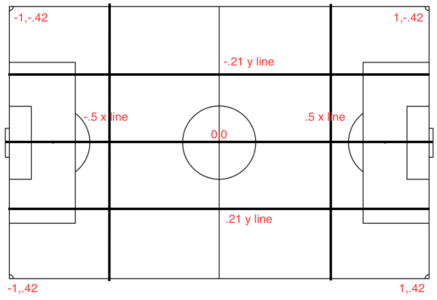

# README

_Source: https://www.kaggle.com/c/google-football/discussion/189720_

## Improvements

### Players should pass the ball
- Players literally don't pass the ball, even the goal keeper.
- Once, the ball is in play, the default behavior is to run with the ball towards the opponents net and once within a threshold distance, shoot!
- But, this is not ideal behavior, particularly when there are other players who potentially have a higher chance of scoring.
- Ex: Shooting from the center is better than shooting from the flanks.

### No shooting from flanks
- Currently, players shoot from the flanks, mostly the left flank towards the goal when they are within the threshold distance of shooting.
- But, the threshold distance is only based on the `X` coordinate.
- So, it so happens that players are shooting from the corner and the opponents goal-keeper has enough time to collect the ball.
- Instead, we want the players to close in on the goal diagonally and then shoot once inside the inner box.

### Goal keeper never crosses the inner box
- When the goal keeper gets the ball, the goal keeper tends to run with the ball towards the opponents net.
- Instead, we want the goal keeper to pass the ball to a player and guard the net.

### Tackle at the future position
- When a player tackles the opponent with a ball, that seems to happen at the older location of the opponent, a place the opponent has moved on from.
- Instead, we want to attack the opponent at the potential future location.

### Ability to detect and break loops in movement

Source: https://www.kaggle.com/c/google-football/discussion/187381#1034619 from Taaha Khan

> Not necessarily a bug, but an interesting thing that I found: in [this game](https://www.kaggle.com/c/google-football/submissions?dialog=episodes-episode-3657442), at around 0:35 time, the ball is right by the edge of bounds, and the agents are all confused as to what should be done (this loop was only broken when the second half reset). Maybe a sort of a clock should be put in place so that agents can't just stall out the rest of the game and force a win if they are ahead, sort of like a shot-clock in basketball.
>
> I recommend contestants to code in something that has the ability to detect and break loops in movement so that this issue can't be exploited in the game.

### Overall Strategies for Football

Source https://www.kaggle.com/c/google-football/discussion/188174 from Taaha Khan

After observing the games for a few days now, I have come up with a list of overall strategies that should help agents play the game better (These are best implemented in rule-based approaches).

#### Offense
- Don't Sprint through the Center: I have seen that the most steals of the ball happen within the center circle of the field because that is the highest density of players. If you sprint through the center, then the ball is almost guaranteed to be stolen from you, so its better to run around.
- (Legally) Stalling:: You only need to win by 1 point to improve your score, so stalling the game to the end could help. If you are winning, then when you get the ball, you can just dribble in circles, or pass back and forth between another player. This may fall under a "dirty" category of playing, but it is a valid tactic that other agents will have to learn to adapt to.
- Avoiding Opponents: Running away from enemies can help prevent others from coming and stealing the ball from you. This requires some calculation as to the enemy distances and positions but is a worthwhile tactic to reducing steals.
- Passing Is Key: Nobody likes a ball hog, and I'm sure that the other players on the team are sick of this one "superior" bot doing all the work for them. Passing helps with opening up space and getting the ball out of dangerous situations, and I think that the other players will be happy to finally get the ball :) .

#### Defense
- Anticipate Ball Position: Its better to run towards where the ball will be in a few frames, than where the ball currently is, because then you will be able to intercept its landing position. This can be done by adding the ball movement vector obs['ball_direction'] to the ball position a few times to get pretty accurate results.
- Run Diagonally: Traveling the hypotenuse is faster than traveling the sum of both legs, so running diagonally will get you to the ball faster to intercept
- Don't Slide Generously: Sliding stops a player from moving for a few frames, so its best to slide cautiously and to not overdo it. For example, I have seen many bots that are chasing after the player with the ball. When they get within some epsilon of distance, they slide, even when behind the player, resulting in the ball player to gain even more ground up ahead. So it's better to slide when you are ahead of the ball or right next to the ball, instead of behind the ball.
- Intercept Goals: You don't just have to go directly to the ball all the time. I find it somewhat better to go to the middle position between the ball and the goal to try and intercept the ball head-on from in front. This helps in stealing, as well as blocks some goals.

If you have more ideas of strategies or disagree with something on the list, feel free to leave a comment and let me know! Thank you Kaggle for organizing such an interesting competition, and I hope to see you all on the field!