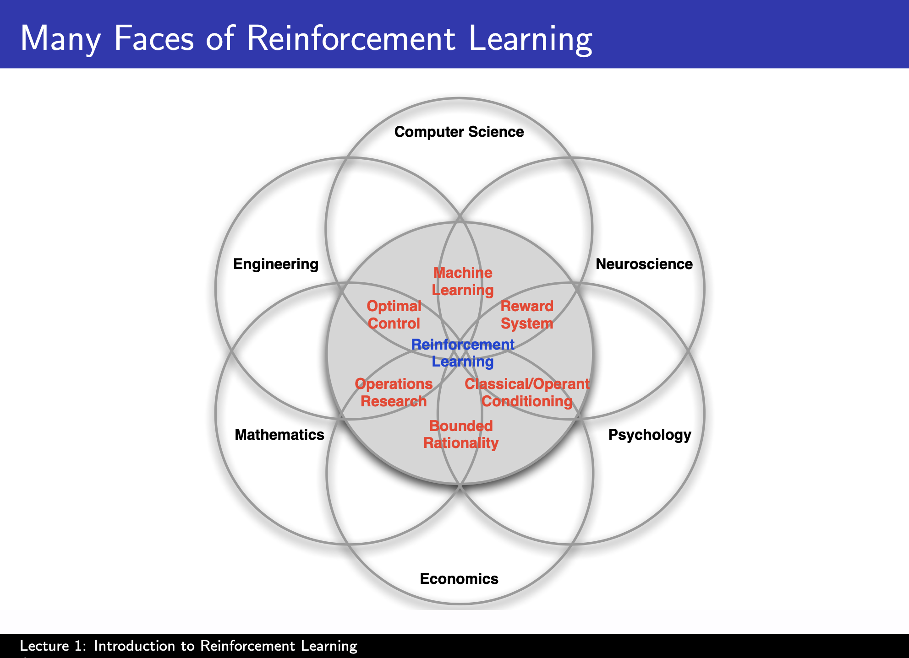
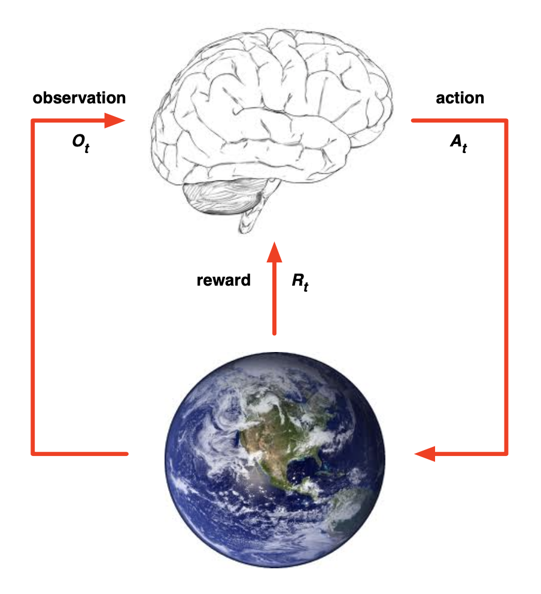
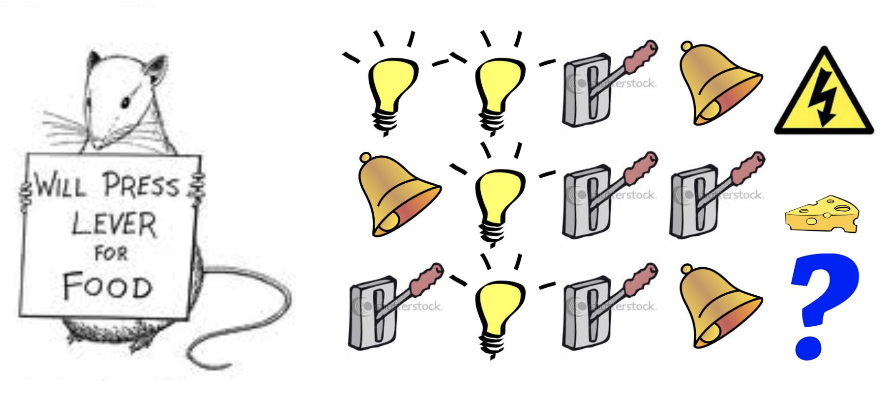

# Lecture 1. Introduction to Reinforcement Learning

## About Reinforcement Learning

> Reinforcement Learning is essentially the science of decision making.

What makes reinforcement learning different from other machine learning paradigms?
- There is no supervisor, instead it's a trial and error paradigm. Only a reward signal.
- Feedback is delayed, not instantaneous.
- Time really matters, it's sequential decision making.
- Agents actions affect the subsequent data it receives.

Examples of reinforcement learning problems:
- Fly stunt manoeuver in a helicopter.
- Defeat the world champion at Backgammon, Go, etc.
- Manage an investment portfolio, what to invest, where and when.
- Controlling a power station.
- Make a humanoid robot walk.
- Play many different Atari games better than humans.

It takes about `3-4 days` of training to achieve human level performance on the Atari games.

## The Reinforcement Learning Problem

### Rewards
- A reward `Rt` is a scalar feedback signal and it indicates how well the agent is doing at step `t`. The agent's goal is to maximize cumulative reward.
- Reinforcement learning is based on the __reward hypothesis__. All goals can be described by the maximization of expected cumulative reward.
- For the helicopter, positive reward when following desired trajectory, negative reward for crashing. For Backgammon, reward winning or losing a game. For investment, we reward money in the bank. For Atari games, it's the increasing or decreasing score.

### Sequential Decision Making
- Select actions to maximize total future reward. But, actions have long term consequences and rewards may be delayed. That means, we have to plan ahead; we have to think ahead.
- It may be better to sacrifice immediate reward to gain more long-term reward. Ex: Investing more money now to gain a profit in the future.

### Agent and Environment

- Terminology: Observation `O^t`. Reward `R^t`. Action `A^t`. Out goal is to build this brain.
- The brain or agent is going to be responsible to take actions. Each step is taken based on information it is receiving from the world and the agent gets a reward on how well it's doing in that step.
- At each step `t`, the agent executes action `A^t`, receives observation `O^t` and receives scaler reward `R^t`. It just goes on and on. We have no control of the environment. But, we get to influence the environment solely by the actions we take within the environment.
- Stream of data coming through: `Observations -> Actions -> Rewards`.
- Ultimately, the agent has to pick actions and to pick actions, the agent would have to weigh goals, one has to decide what you care about.
- You compare them by laying them on an axis, and there must be a conversion to a single scalar reward.

### History and state
- The history, `H^t` is the sequence of observations, actions and rewards. All observable variables up to time `t`. What happens next depends on the history.
- Our goal of the agent is to build a mapping between the history and the next action. And the environment in turn selects the observations and rewards.
- State, `S^t` is the information used to determine what happens next. Formally, state is a function of the history.

> St = f(Ht)

- Environment state `S^et` is the private information in the environment to determine what happens next. But, this is not usually visible to the agent. Even when we can see it may contain irrelevant information.
- Agent state `S^at` is the agents internal representation that is used to pick next action. This is the decision of the agent builder on what observation to store and how and what to throw away. And, it can be any function of the history.
- Information status or Markov state contains all useful information from the history. A state `St` is Markov; __the future is independent of the past given the preset.__ Or state is a sufficient statistic of the future.
- For the helicopter, the Markov state would be the current location, velocity, wind direction, etc. It does not matter where the helicopter was `10 minutes` ago. But, if you had just location and not velocity, you will have to look back in time.
- By definition, the environment state is Markov, the entire history is Markov.

> Is human life Markov?

What we believe will happen next depends on our representation of state. So, the state representation really defines that happens next. Our job is build an agent state that is useful and effective at predicting what happens next.

### Observable environments

### Fully observable environments
- Type of environment where the agent literally gets to see what happens in the environment.
- Observation is the same as the environment state which is same as the agents state. Formally, this is a __Markov Decision Process (MDP)__.

### Partially observable environments
- Agent indirectly observes environment. Ex: In poker the playing agent only observes public cards.
- Thus, the agent state is not equal to the environement state. This is called Partially observable Markov Decision Process or `POMDP`.
- Thus, the agent must construct it's own representation.
    - Naive approach: Remember everything or complete history.
    - Beliefs of environment state. Probabilities for the environment states.
    - Recurrent Neural Network.

## Inside an RL Agent
