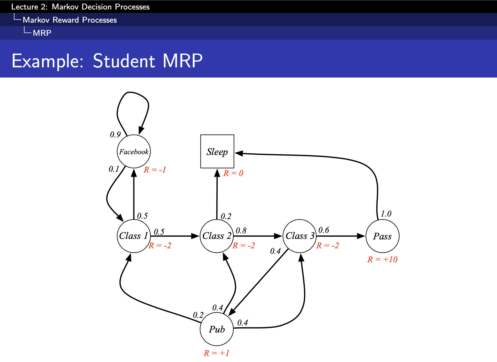
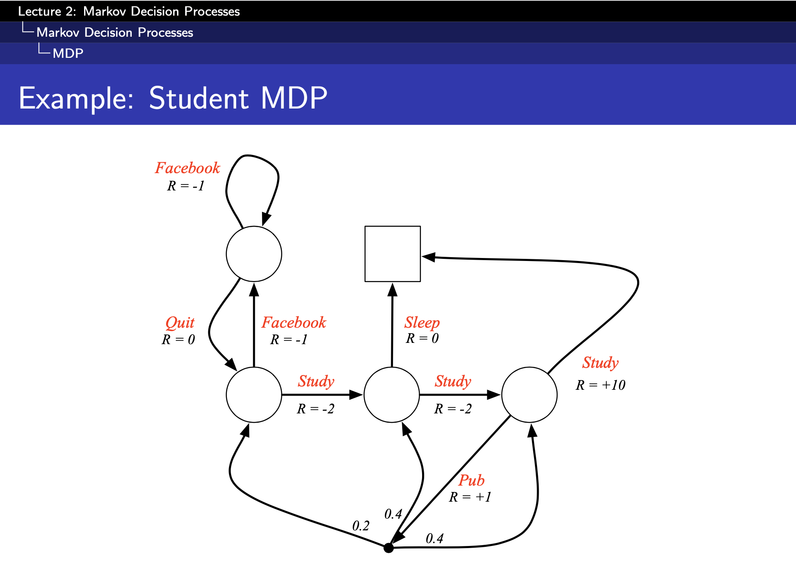
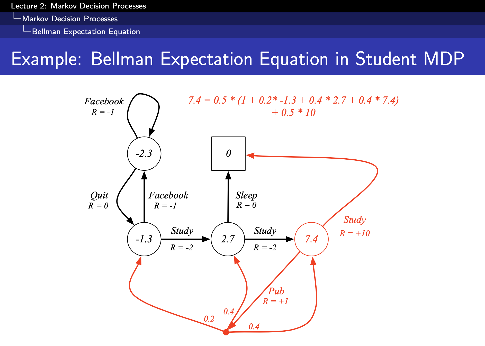
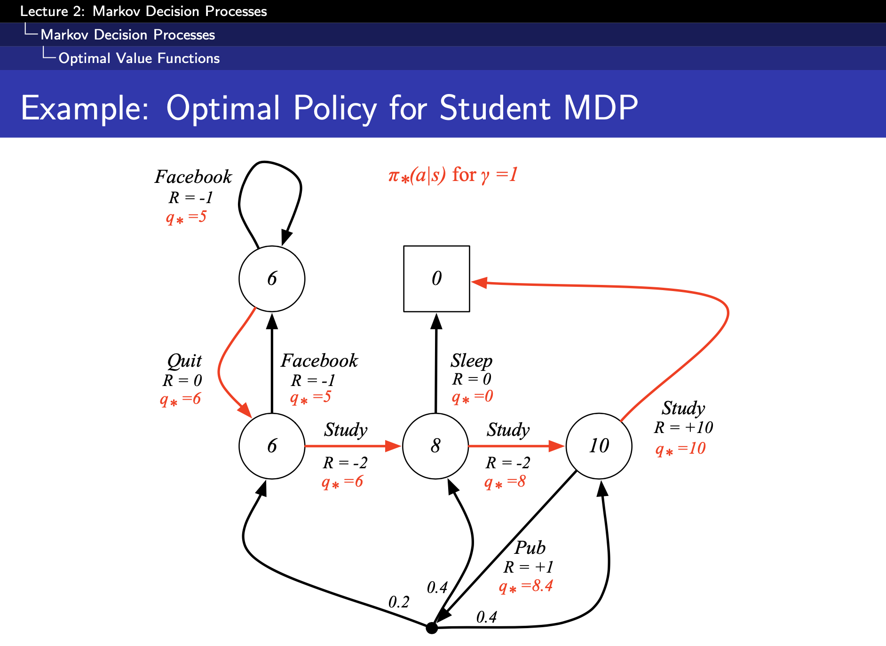

# Lecture 2: Markov Decision Process

Source: https://www.youtube.com/watch?v=lfHX2hHRMVQ&list=PLqYmG7hTraZDM-OYHWgPebj2MfCFzFObQ&index=2


> The only stupid question is the one you were afraid to ask but never did - Rich Sutton.

## Markov Processes
Markov decision processes formally describe an environment for reinforcement learning. Here the environment is fully observable and the current state completely characterizes the process. Almost all RL problems can be formalized as MDPs.

A Markov process is a memory less random process, a sequence of random states with the Markov property. It's a tuple `(S, P)` where:
- `S` is a finite set of states.
- P is a state transition probability matrix.

__Bandits__ are MDPs with one state:
- There are a set of actions.
- You get to take an action.
- You get a reward for that action.
- And that's the end to the task.
- Ex: Ad is served and whether its served or not.

Markov property, the future is independent of the past given the present. The state captures all relevant information from the history. Once the state is know, the history may be thrown away; the state is a sufficient statistic of the future. A `square` represents a terminal state.

Sample is a sequence of states.

State transition matrix `P` defines transition probabilities from all states `s` to all successor states `s'` where each row of the matrix is for one state and the probabilities add up to one. All rows together fully describe the entire dynamics of the system.

Non-stationary MDPs, incrementally adjust the solution.


## Markov Reward Processes
Markov reward process is a Markov chain with values. It's a tuple of `(S, P., R, 𝛄)` where:
- `S` is a finite set of states.
- `P` is a state transition probability matrix.
-  `R` is a reward function; if we are in some state, what is the immediate reward we get in that state.
-  `𝛄` is the __discount factor__ and can have a value `[0, 1]`.



What we care about is the total reward when we follow through an entire sequence.

The return `Gt` is the total discounted reward from time-step `t`. The goal of Reinforcement Learning is to maximize the return. The value of receiving reward `R` afte `k+1` time steps is `𝛄^k * R`

We prefer a short-term reward to a delayed reward, reward now to a reward later. And the amount of reward we prefer now to reward later is given by `𝛄`.
- `𝛄` close to `0` leads to myopic evaluation.
- `𝛄` close to `1` leads to far-sighted evaluation.

One reason to use the discount factor is to represent that we do not have a perfect model.
- Mathematically convenient to discount rewards.
- Avoids infinite returns in cyclic Markov processes.
- Uncertainty about the future may not be fully represented.
- If the reward is financial, immediate rewards may earn more interest than delayed rewards.
- Animal/human behavior shows preference for immediate rewards.
- It is sometimes possible to use un-discounted Markov reward processes where `𝛄=1`.

The value function `v(s)` gives the long-term value of state `s`. It's the expected return starting from state `s`. The expectation over the different parts we can take through the system and we take an average of that to get a summary of how good it is to be in that state.

> One comes to a state and then gets a reward.

Bellman equations, the value can be decomposed into two parts and can be represented using matrices. One linear equation, you solve it and you have the value function.
- Immediate reward `R (t+1)`.
- Discounted value of successor state.

> v = R + 𝛄Pv

where `v` is the column vector with one entry per state. The computational complexity is `O(N3)` for `n` states and so works only for small MRPs. Other iterative methods are:
- Dynamic programming.
- Monte-Carlo evaluation.
- Temporal-Difference learning.


## Markov Decision Processes (MDPs)
A MDP is a Markov reward process with decisions. It is an environment in which all states are Markov. It's now a tuple of `(S, A, P, R, 𝛄)` where A is a finite set of actions and the transition probability matrix depends on the action one takes.



A policy `π` is a distribution over actions given states and it fully defines the behavior of an agent. MDP policies depend on the current state, not the history and they are stationary (not time dependent).

> What state am I in and what action should I take? All we care about how much reward we can get from now onwards into the future.

- The __state-value function__ of an MDP is the expected return starting from state `s` and then following the policy `π`.
- The __action-value function__ is the expected return starting from state `s`, taking action `a` and then following policy `π`.

Two-step look ahead, starting from either a state or an action.
- What are the the different actions we can take.
- What are all the things the environment might do at each of these states.
- How good is the states that we end up in after this.

> It's a very simple idea, the value function at the current time step is equal to the immediate reward plus the value function of where you end up.

```python
# You will get 7.4 units of reward in expectation if you behave according to this policy.
7.4 = (0.5 * 10) + (0.5 * (1 + 0.4 * 7.4 + 0.4 * 2.7 + 0.2 * (-1.3)))
```



If you take the `Pub` action, from the state with value `7.4` you end up at the dot in the bottom where the environment transitions you to the 3 possible states with the probabilities. The reward you get in the process is `1`. What you do might affect the immediate reward you get as well as the state you end up in.

> Markov Decision Processes (MDPs) are stochastic, you get to take an action; the environment gets to roll a dice and tell you where you end up. It's a combination of your actions and the dice which gets rolled by the environment which determine what happens next.

- The optimal state-value function `v*` is the maximum value function over all policies, what is the max reward that we can extract from the system.
- The optimal action-value function `q*` is the maximum action-value function over all policies.

Optimal policy, what's the best possible way to behave in an MDP. We want to know what is means for one policy to be better than another policy. For any MDP, there exists an optimal policy `π*` that is better than or equal to all other policies.




#### Bellman Optimality Equation
The optimal value functions are recursively related by the Bellman optimality equations; instead of taking the average, we take the max. Look at the value of each of the actions we can take and pick the max of them and that is going to tell you how good it is to be in this state; max of all `Q` values. Thus, the value function of a state is the max of the Q values of each of actions you can take from that state.

But, we don't get to choose what the environment does to us. So, we need to take the average here, not the max. Bellman optimality equation is non-linear and many iterative solutions:
- Value iteration
- Policy iteration
- Q-learning
- Sarsa


## Extensions to MDPs
- Infinite and continuous MDPs.
- Partially observable MDPs.
- Un-Discounted, average reward MDPs.
