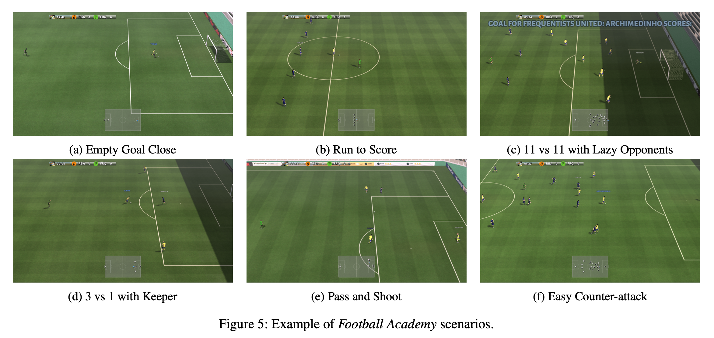

# Google Research Football: A Novel Reinforcement Learning Environment

_Source: https://arxiv.org/abs/1907.11180_

The goal of reinforcement learning (RL) is to train smart agents that can interact with their environment and solve complex tasks. An environment should ideally provide the tools to a variety of current reinforcement learning research topics such as:
- The impact of stochasticity
- Self-play.
- Multi-agent setups.
- Model-based reinforcement learning.
- Requiring smart decisions, tactics, and strategies at multiple levels of abstraction.

The Football Environment provides a physics-based 3D football simulation where agents have to control their players, learn how to pass in between them and how to overcome their opponent's defense in order to score goals. Wxisting environments exhibit a variety of drawbacks that we address with the Google Research Football Environment:
- Easy to solve.
- Computationally expensive.
- Lack of stochasticity.
- Lack of open-source license.
- Known model of the environment.
- Single-player.

Cooperative multi-agent learning also offers many opportunities and challenges, such as:
- Communication between agents.
- Agent behavior specialization.
- Robustness to the failure of some of the agents.

The length of the game is measured in terms of the number of frames, and the default duration of a full game is `3000 (10 frames per second for 5 minutes)`. Players on a team have different statistics, such as speed or accuracy and __get tired over time__. Also, players differ within a team, both teams have exactly the same set of players, to ensure a fair game. The difficulty level `θ` can be smoothly parameterized between 0 and 1, by speeding up or slow- ing down the bot reaction time and decision making. Easy (θ = 0.05), Medium (θ = 0.6), and Hard (θ = 0.95). The definition of the __state__ contains information such as:
- The ball position and possession.
- Coordinates of all players.
- The active player.
- The game state (tiredness levels of players, yellow cards, score, etc).
- The current pixel frame.

The Football Engine includes two reward functions that can be used out-of-the-box:
- Scoring: Corresponds to the natural reward where each team obtains a +1 reward when scoring a goal, and a −1 reward when conceding one to the opposing team.
- Checkpoint: It augments the scoring reward with an additional auxiliary reward contribution for moving the ball close to the opponent's goal in a controlled fashion.


Example code that runs a random agent on our environment.

```python
import gfootball.env as football_env

env = football_env.create_environment(env_name='11_vs_11_stochastic', render=True)
env.reset()

done = False
while not done:
    action = env.action_space.sample()
    observation, reward, done, info = env.step(action)
```

We provide benchmark results for three state- of-the-art reinforcement learning algorithms:
- PPO and IMPALA which are popular policy gradient methods.
    - IMPALA: Importance Weighted Actor-Learner Architecture.
    - PPO: Proximal Policy Optimization.
- Ape-X DQN which is a modern DQN implementation.

To allow researchers to quickly iterate on new research ideas, we also provide the Football Academy, a diverse set of `11 scenarios` of varying difficulty. These scenarios can be considered _unit tests_ for reinforcement learning algorithms where one can obtain reasonable results within minutes or hours instead of days or even weeks. All scenarios end after `400 frames` or if the ball is lost, if a team scores, or if the game is stopped.



Three research topics which have recently become quite active in the reinforcement learning community:
- Self-play training. When a policy is trained against a fixed opponent, it may exploit its particular weaknesses and, thus, it may not generalize well to other adversaries.
- Multi-agent learning. Training is initially slower when we control more players, but the policies seem to eventually learn more complex behaviors and achieve higher scores.
- Representation learning for downstream tasks.
