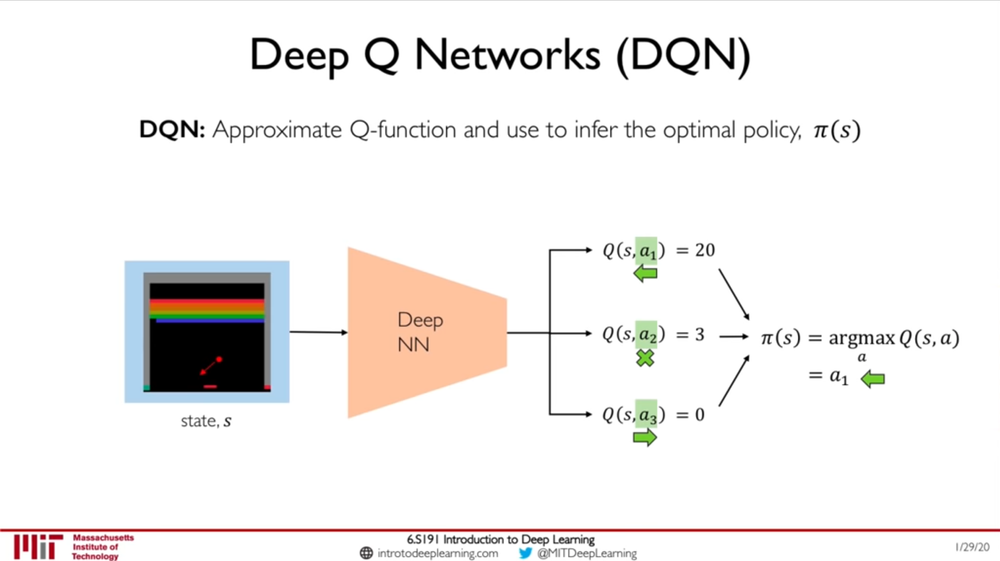
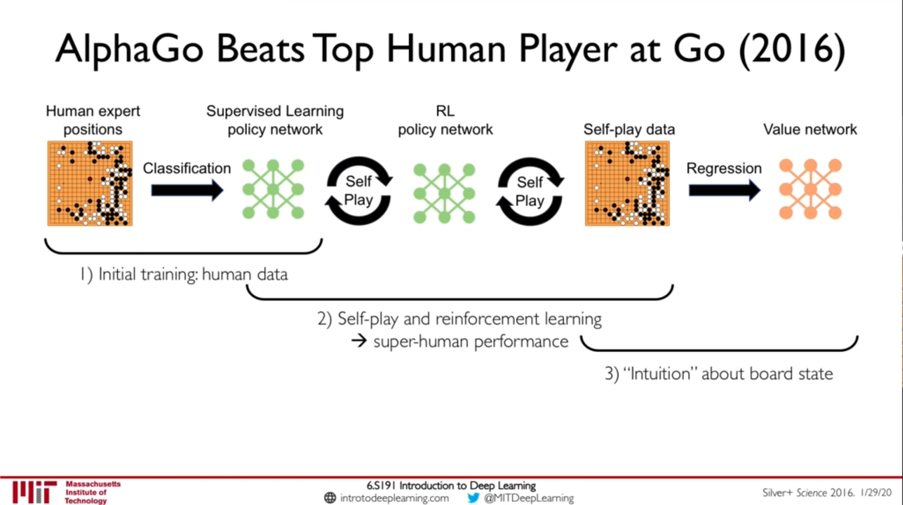

# Reinforcement Learning | MIT 6.S191

Source: https://www.youtube.com/watch?v=nZfaHIxDD5w

> Learning in Dynamic Environments.

### Classes of learning problems
- Supervised learning: Take data and learn to predict the label.
- Unsupervised learning: Learn underlying structure in the data.
- Reinforcement learning: Maximize future rewards over many time steps.

### Key concepts
- Agent or the neural network takes actions.
- Environment is the world in which the agent exists and operates.
- Action is a move the agent makes in the environment.
    - Agent space is the set of possible actions an agent can take in the environment.
- Observations are returned by the environment to the agent.
- Reward is the feedback that measures the success or failure of the agent's action.
    - Total reward is the discounted sum of all rewards obtained from time `t`.
- Discount factor is typically between zero and one.

### Q function
The Q-function captures the expected total future reward an agent in state `s` can receive by executing a certain action, `a`. High Q values means, a desireable action.

Ultimately, the agent needs a policy to infer the best action to take at it's state, `s` where the strategy is that the policy should choose an action that maximizes future reward.

Two classes of Reinforcement Learning algorithms
- Value learning: Learn the Q function and use that to define policy.
- Policy learning: Directly learn the policy.

### Deep Q Networks
We pick the action with the highest `Q` value and take action. There are two kinds of networks we can build:
- Neural network takes in a state and an action and returns a `Q` value. But, we will have to feed in all actions to get `Q` values for all actions.
- Instead, we could have a neural network that takes a state as input and outputs `Q` values for all actions.

### Policy gradient
The output is a probability distribution over the space of all actions given that state. This is the probability of given that state, taking that action result in the highest `Q` value, not what is the `Q` value. At any point the agent wants to take action, it will sample from the probability distribution and take the action. _NOTE: The total of all probabilities will add up to `1`._

A discrete action space will tell in what direction should I move while a continuous action space will tell how fast should I move in whatever direction.

Training algorithm
1. Initialize the agent.
2. Run a policy until termination.
3. Record all `(states, actions, rewards)`.
4. Decrease probability of actions that resulted in low reward.
5. Increase probability of actions that resulted in high reward.

### Alpha Go

Alpha Zero used self-play all the way through. In Alpha Go, a build up of expert data was used to imitate.